# GNS3 CONFIG

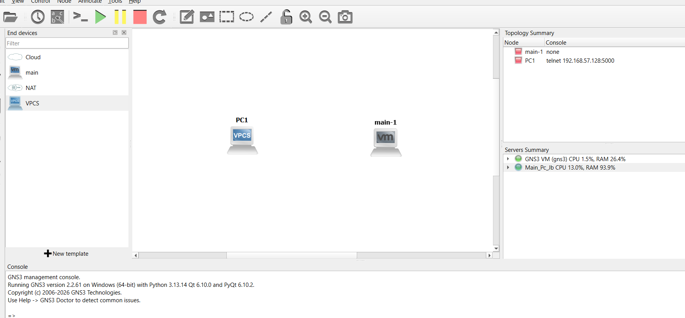
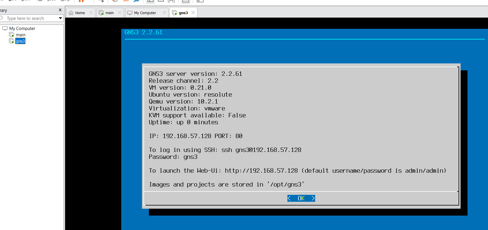

# 00. Confirmar direcciones ipv4 en el mismo grupo

## Maquina GNS3
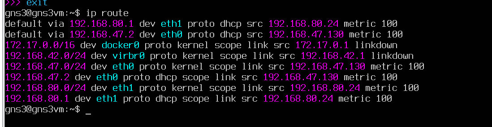

## Maquina Kali Linux
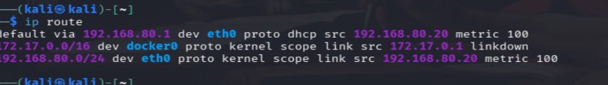

# 01. Confirmar que hay comunicacion

## Ping kali -> GNS3-vm
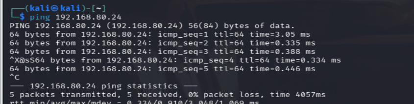

## Ping GNS3-vm -> Kali
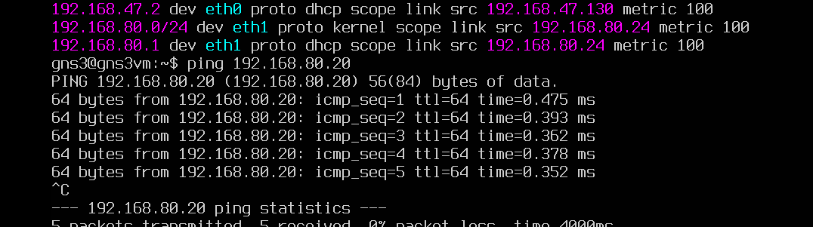

# 03. Me conecto por ssh a GNS3-vm para trabajar mejor en esta maquina

## credenciales gns3:gns3

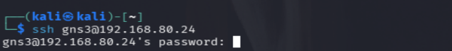

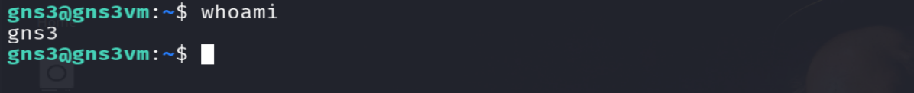


# 04. Creacion de scripts server tcp y udp en gns3-vm 


**tcp_server.py**


```
import socket

HOST = '0.0.0.0'  # Escuchar en todas las interfaces de red
PORT = 65432      # Puerto de escucha

with socket.socket(socket.AF_INET, socket.SOCK_STREAM) as server_socket:
    server_socket.bind((HOST, PORT))
    server_socket.listen()
    print(f"[TCP Server] Escuchando en {HOST}:{PORT}...")

    conn, addr = server_socket.accept()
    with conn:
        print(f"[TCP Server] Conexión establecida desde {addr}")
        while True:
            data = conn.recv(1024)
            if not data:
                break
            print(f"[TCP Server] Recibido: {data.decode('utf-8')}")
            conn.sendall(b"ACK TCP: Mensaje recibido correctamente")
```

**udp_server.py**


```
import socket

HOST = '0.0.0.0'
PORT = 65433

with socket.socket(socket.AF_INET, socket.SOCK_DGRAM) as server_socket:
    server_socket.bind((HOST, PORT))
    print(f"[UDP Server] Escuchando datagramas en {HOST}:{PORT}...")

    while True:
        data, addr = server_socket.recvfrom(1024)
        print(f"[UDP Server] Recibido de {addr}: {data.decode('utf-8')}")
        server_socket.sendto(b"ACK UDP: Datagrama recibido", addr)
        break  # Finaliza tras recibir un mensaje (opcional)
```

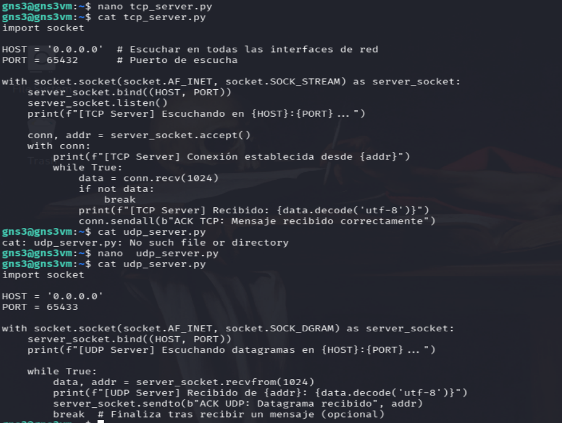

# 04. Creacion de scripts client tcp y udp en kali

**tcp_client.py**


```
import socket

HOST = '192.168.80.24'  
PORT = 65432

with socket.socket(socket.AF_INET, socket.SOCK_STREAM) as client_socket:
    client_socket.connect((HOST, PORT))
    mensaje = "Hola desde el Cliente TCP"
    print(f"[TCP Client] Enviando: {mensaje}")
    client_socket.sendall(mensaje.encode('utf-8'))

    respuesta = client_socket.recv(1024)
    print(f"[TCP Client] Respuesta del servidor: {respuesta.decode('utf-8')}")
```

**udp_client.py**


```
import socket

HOST = '192.168.80.24' 
PORT = 65433

with socket.socket(socket.AF_INET, socket.SOCK_DGRAM) as client_socket:
    mensaje = "Hola desde el Cliente UDP"
    print(f"[UDP Client] Enviando: {mensaje}")
    client_socket.sendto(mensaje.encode('utf-8'), (HOST, PORT))

    respuesta, _ = client_socket.recvfrom(1024)
    print(f"[UDP Client] Respuesta del servidor: {respuesta.decode('utf-8')}")
```
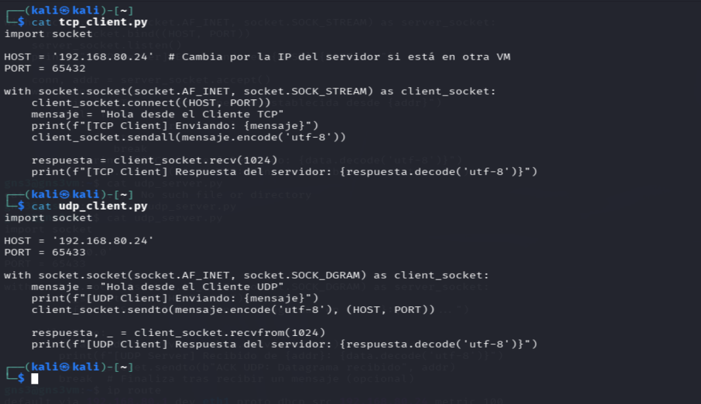

# 05. Ejecutar la transmicion UDP

### Client

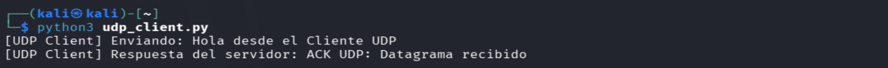

### Server

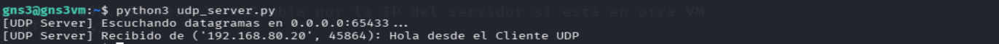

### Wireshark UDP filter

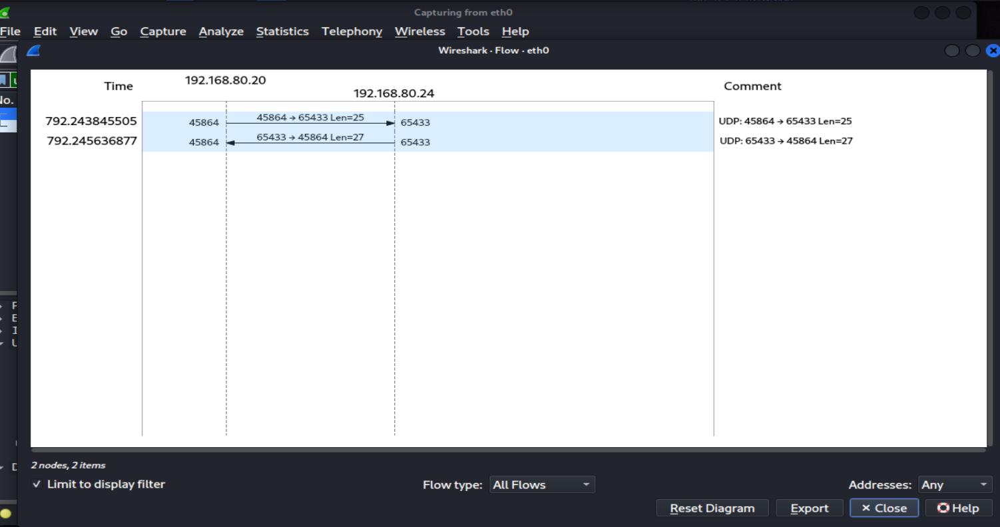

# 06. Ejecutar la transmicion TCP

### Client

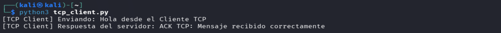

### Server

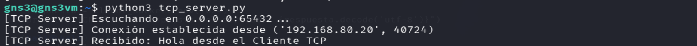

### Wireshark TCP filter
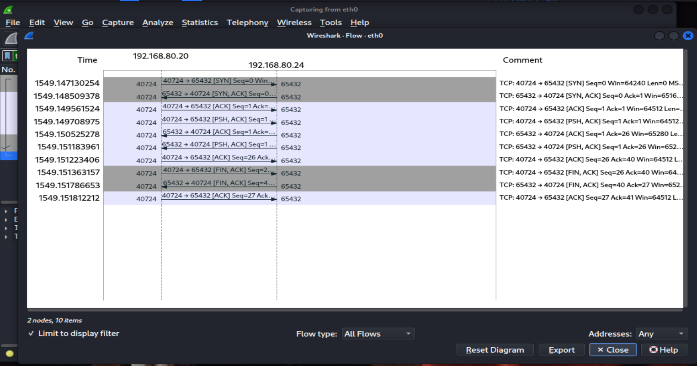


# 07. mismo procediemiento TCP-UDP usando Windows-Linux 

### La conexión será gns3-vm (server), Windows (Cliente), usando los mismos scripts de server para gns3-vm que se usaron en pasos anteriores

**tcp_client_win**

```
import socket

SERVER_IP = "192.168.80.24"  
SERVER_PORT = 65432

def main():
    try:
        # Creación del socket TCP
        with socket.socket(socket.AF_INET, socket.SOCK_STREAM) as client_socket:
            print(f"[TCP] Conectando a {SERVER_IP}:{SERVER_PORT}...")
            client_socket.connect((SERVER_IP, SERVER_PORT))
            
            mensaje = "Hola Servidor Linux, saludo desde Windows (TCP)"
            print(f"[TCP] Enviando: {mensaje}")
            client_socket.sendall(mensaje.encode('utf-8'))
            
            # Recepción de la respuesta
            respuesta = client_socket.recv(1024)
            print(f"[TCP] Respuesta recibida: {respuesta.decode('utf-8')}")
            
    except ConnectionRefusedError:
        print("[ERROR] Conexión rechazada. Asegúrate de que el servidor TCP esté corriendo en Linux y el puerto esté abierto.")
    except Exception as e:
        print(f"[ERROR] Ocurrió un fallo: {e}")

if __name__ == "__main__":
    main()
```

**udp_client_win**

```
import socket

SERVER_IP = "192.168.80.24"  
SERVER_PORT = 65433

def main():
    try:
        # Creación del socket UDP
        with socket.socket(socket.AF_INET, socket.SOCK_DGRAM) as client_socket:
            # Tiempo de espera máximo de 3 segundos para evitar que se quede colgado si no responde el servidor
            client_socket.settimeout(3.0)
            
            mensaje = "Hola Servidor Linux, saludo desde Windows (UDP)"
            print(f"[UDP] Enviando datagrama a {SERVER_IP}:{SERVER_PORT}...")
            client_socket.sendto(mensaje.encode('utf-8'), (SERVER_IP, SERVER_PORT))
            
            # Recepción de la respuesta
            respuesta, addr = client_socket.recvfrom(1024)
            print(f"[UDP] Respuesta desde {addr}: {respuesta.decode('utf-8')}")
            
    except socket.timeout:
        print("[UDP] Tiempo de espera agotado (Timeout). El servidor no respondió o el puerto está cerrado/bloqueado.")
    except Exception as e:
        print(f"[ERROR] Ocurrió un fallo: {e}")

if __name__ == "__main__":
    main()
```
## TCP Tansmision

### Client

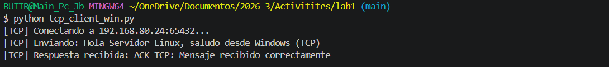

### Server

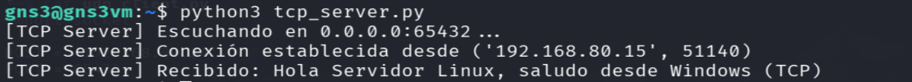

### wireshark lecture

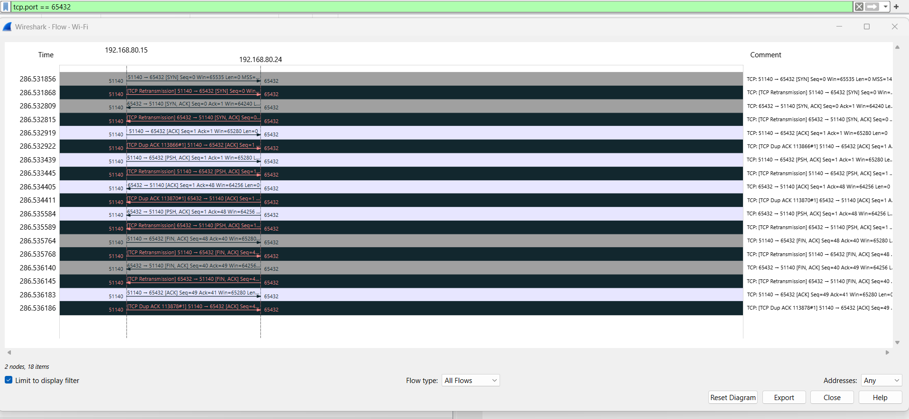


## UDP Tansmision

### Client

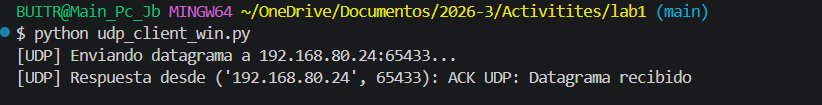

### Server

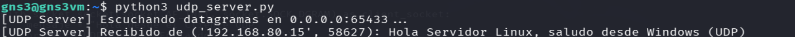


### Wireshark lecture

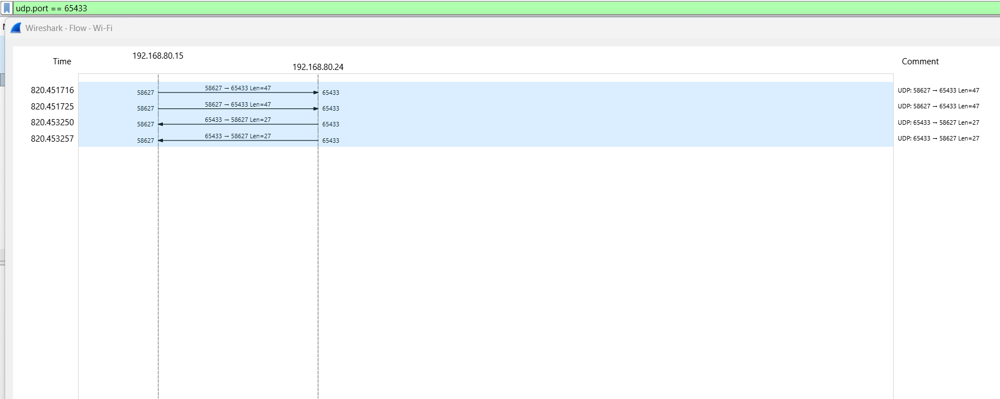