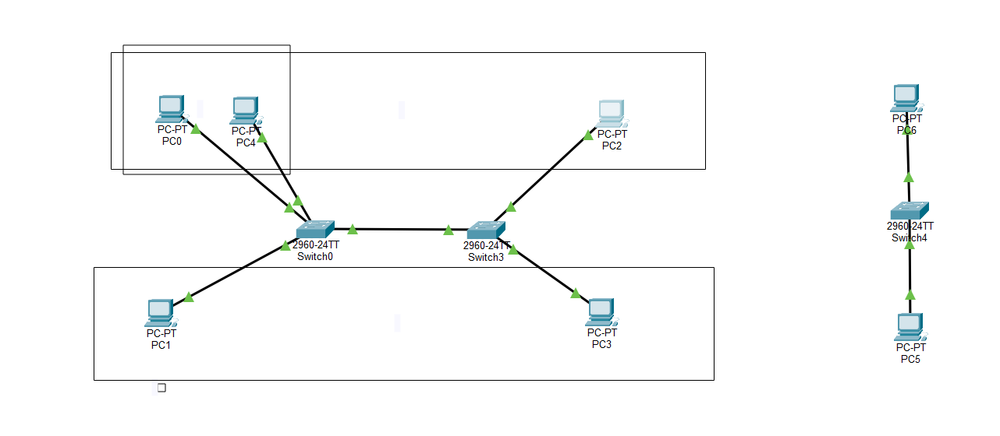

# Configuración de VLANs y Trunk entre Switches

## Topología

Se configuraron dos switches conectados mediante un enlace **trunk**, permitiendo el transporte de las VLAN 10 y 20.

```text
PC1 ── VLAN 10 ── SW1 ═════ TRUNK ═════ SW2 ── VLAN 10 ── PC2
PC3 ── VLAN 20 ── SW1 ═════ TRUNK ═════ SW2 ── VLAN 20 ── PC4
```

## 1. Crear las VLAN

En ambos switches:

```cisco
enable
configure terminal

vlan 10
name VLAN10
exit

vlan 20
name VLAN20
exit
```

## 2. Configurar puertos de acceso

### Switch 1

Puerto conectado al PC de VLAN 10:

```cisco
interface range f0/1-9
switchport mode access
switchport access vlan 10
exit
```

Puerto conectado al PC de VLAN 20:

```cisco
interface range f0/10-15
switchport mode access
switchport access vlan 20
exit
```

### Switch 2

Puerto conectado al PC de VLAN 10:

```cisco
interface fa0/1
switchport mode access
switchport access vlan 10
exit
```

Puerto conectado al PC de VLAN 20:

```cisco
interface fa0/2
switchport mode access
switchport access vlan 20
exit
```

## 3. Configurar el enlace Trunk

El puerto `Fa0/24` se utiliza para conectar ambos switches.

### Switch 1

```cisco
interface f0/24
switchport mode trunk
switchport trunk allowed vlan 10,20
exit
```

### Switch 2

```cisco
interface f0/24
switchport mode trunk
switchport trunk allowed vlan 10,20
exit
```

## 4. Verificación

### Ver las VLAN configuradas

```cisco
show vlan brief
```

### Verificar el estado del trunk

```cisco
show interfaces trunk
```

### Verificar la configuración de una interfaz

```cisco
show running-config interface fa0/24
```

## 5. Pruebas de conectividad

Los PCs pertenecientes a la misma VLAN, aunque estén conectados a diferentes switches, deben poder comunicarse entre sí.

```text
PC1 (VLAN 10) → PC2 (VLAN 10)    ✓
PC3 (VLAN 20) → PC4 (VLAN 20)    ✓
```

La comunicación entre VLANs diferentes no debe funcionar sin un dispositivo de capa 3 que realice routing:

```text
VLAN 10 → VLAN 20    ✗
```

## Comandos principales utilizados

```cisco
enable
configure terminal

vlan 10
vlan 20

interface fa0/1
switchport mode access
switchport access vlan 10

interface fa0/2
switchport mode access
switchport access vlan 20

interface fa0/24
switchport mode trunk
switchport trunk allowed vlan 10,20

show vlan brief
show interfaces trunk
show running-config interface fa0/24
```



