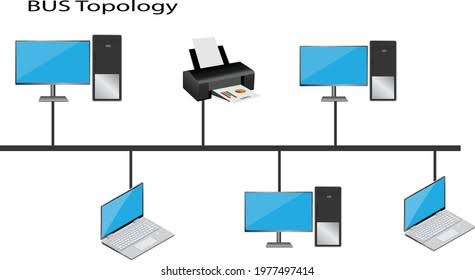
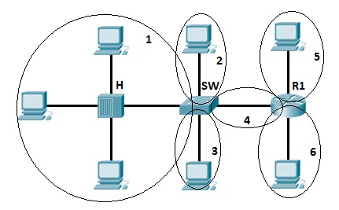
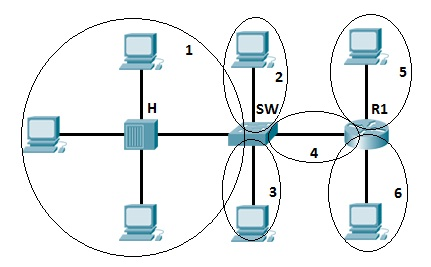
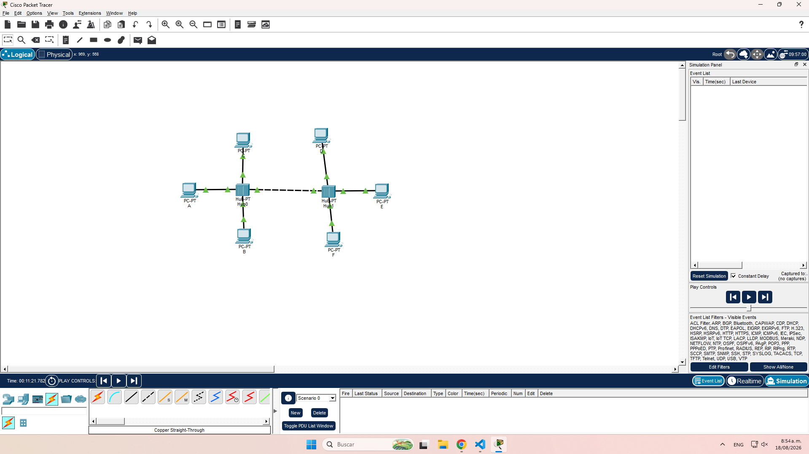
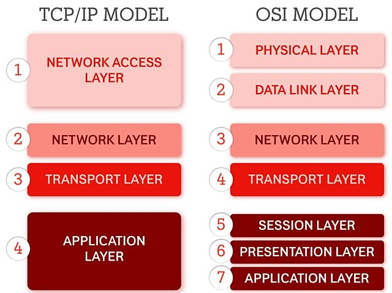

# Tecnicas de Multiplexion

- TDM y FDM 
  

## TDM 

- Usa la misma frecuencia para todos.
- Da turnos de tiempo muy rápidos a cada señal.
- Bueno para datos modernos de tipo digital.
- Necesita un reloj o señal para coordinar los turnos.

## FDM (Multiplexion pr ancho de banda)

- Usa frecuencias distintas para cada usuario.
- Transmite al mismo tiempo.
- Bueno para señales viejas o de tipo analógico.
- Usa espacio libre entre frecuencias para no chocar.

Dispone de un espectro mas pequeño. A mas usuarios de degrada la señal.

**Acceso multiple por ivision de freuencia ortogonal** (Nowadays)

## En una topologia fisica tipo Bus

Dominios de frecuencia en capa 2-3 

## Dominios de Colison

Nota: Dispositvos DSS (Hubs) / Dispsitivs DCS

``Tarea: 1. En cisco Packet Tracer y Usando GNS-3 es psble visulaizar una colision  en GNS-3 por medio del wireshark. Como el uso de la capa 2 resuelve el renvio de informacion masivo para alcanzar el destno 3. Investigar G6 "OMA" 4. Diferencias entre la subcapa LLC y la sub capa MAC``

### Interconexion de Terminales DTE - DCE o DTE - DTE

#### Cable Direct 

**Medio Incomatible**
DTE..................................DTE
TX------------------------------TX (Transmicion)
RX------------------------------RX (Recepcion)
                               
DTE............................................................DTE
TX------------------TX DCE RX-------------RX DTE
RX------------------RX DCE TX-------------TX DTE

# Capa enlace de dats

## Identifcadores a nivel de direccionamiento

### Direccones del modelo de referencia OSI

- MAC capa 2 
- IP capa 3 
- PUERTO capa 4 
- ESPECFICO capa 4 

Logica en bus: Existe un solo medio de tranmision donde si se envian packetes de manera simulatanea aparecen colisiones

tecnlogia de capa ed: Una tecnologia que permite darle forma a una red a nivel de capa 2 (???)

### FORMATO DE TRAMA IEEE 802.3