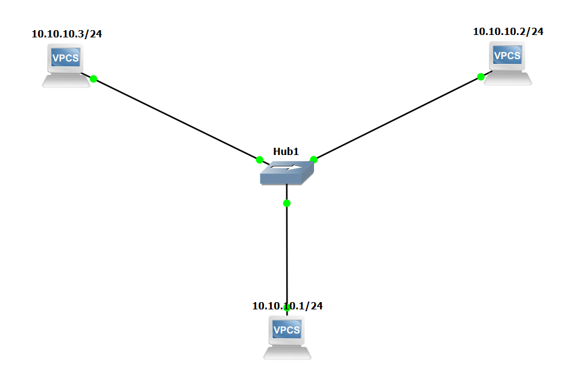
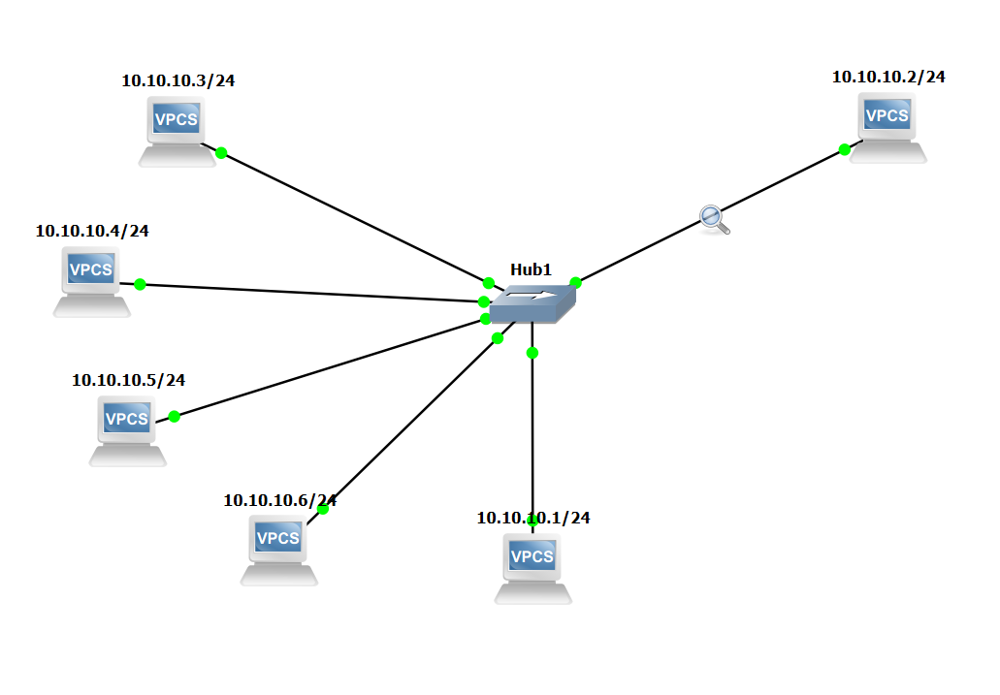
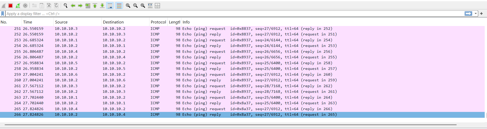
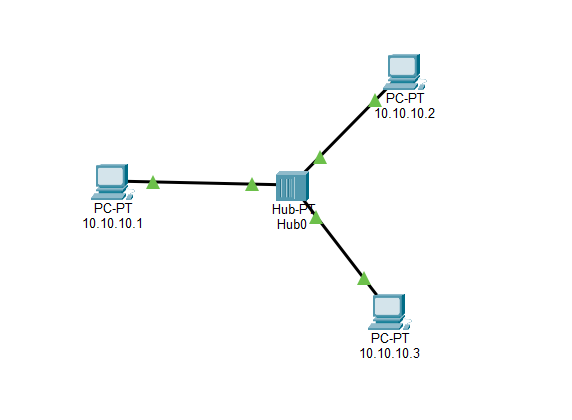
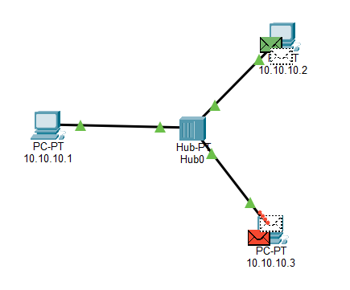
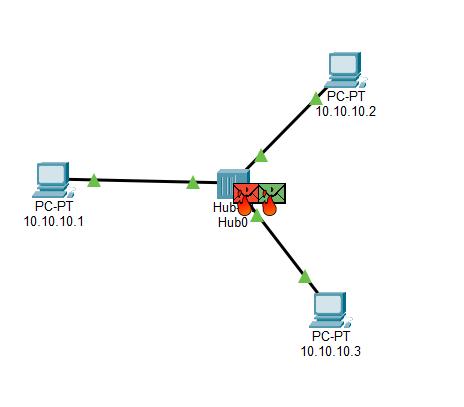

# Colisiones GNS3

# Resultados obtenidos en GNS3

- Se montó una topología con un **Hub Ethernet** y **6 VPCS** conectados a él.
- Se generó tráfico simultáneo: **5 PCs haciendo ping al mismo tiempo hacia 1 PC destino**.
- En Wireshark se observaron tramas de **varios orígenes distintos llegando casi al mismo instante** por el mismo enlace del Hub.
- **No se registró ningún paquete perdido, corrupto o retransmitido** durante toda la captura.
- **Conclusión:** GNS3 permite ver la *condición lógica* de un dominio de colisión (varios equipos compartiendo el mismo medio a la vez), pero **no simula colisiones reales** porque opera a nivel de emulación de paquetes, no a nivel eléctrico/físico.

# Colisiones CISCO PT

# Resultados obtenidos en Cisco Packet Tracer
 
- Se montó una topología con un **Hub** y **3 PCs** conectados a él (PC1: 10.10.10.1, PC2: 10.10.10.2, PC3: 10.10.10.3).
- Se generó tráfico simultáneo entre los PCs en **modo Simulation**.
- Packet Tracer **sí marcó visualmente la colisión**: aparecieron íconos rojos de colisión justo sobre el Hub, en el punto donde confluyen los tres enlaces.
- La colisión ocurrió porque el Hub reenvía todo el tráfico a todos sus puertos, y dos tramas intentaron pasar por el medio compartido al mismo tiempo.
- **Conclusión:** a diferencia de GNS3, Packet Tracer sí modela el evento de colisión de forma explícita en su modo Simulation, porque simula el comportamiento lógico de CSMA/CD sobre el medio compartido, mientras que GNS3 solo permite inferir la condición de riesgo por concurrencia de tráfico.
 

## Inv 
- Un **Hub** (capa 1) no sabe nada de direcciones: cuando le llega una trama, la reenvía **por todos los puertos** (flooding total) — de ahí que todos comparten el mismo dominio de colisión.
- Un **Switch** (capa 2) resuelve esto construyendo y usando una **tabla de direcciones MAC (MAC Address Table / CAM Table)**:
  1. **Aprendizaje (Learning):** cuando entra una trama por un puerto, el switch guarda en su tabla qué MAC de origen está conectada a ese puerto.
  2. **Reenvío inteligente (Forwarding):** si la MAC de destino ya está en la tabla, el switch envía la trama **únicamente por ese puerto** (unicast), no a todos.
  3. **Inundación controlada (Flooding):** si la MAC de destino **no** está en la tabla (o es broadcast), ahí sí la reenvía por todos los puertos, pero solo hasta que aprenda dónde está esa MAC.
  4. **Envejecimiento (Aging):** las entradas de la tabla expiran después de un tiempo sin tráfico, para mantenerla actualizada.
- **Resultado:** cada puerto del switch se convierte en su propio dominio de colisión, y el tráfico solo se envía por el camino necesario en vez de saturar todo el segmento — esto es justo lo que evitó las colisiones que viste con el Hub.
---
 
## 3. Investigar "G6 / OMA"
 
> Nota: no encontré un estándar llamado literalmente "G.6 OMA" en fuentes de la UIT-T ni en documentación de redes. Es posible que la consigna original diga **"6G"** y **"OMA"** como dos temas de investigación relacionados (fácil de confundir al transcribir "6G" como "G6"). Te dejo el desarrollo bajo esa interpretación — confírmalo con tu profesor para estar seguro.
 
### OMA (Orthogonal Multiple Access / Acceso Múltiple Ortogonal)
 
- Es la familia de técnicas de acceso múltiple donde **cada usuario recibe un recurso exclusivo** (tiempo, frecuencia o código) que **no se superpone** con el de otros usuarios — de ahí "ortogonal".
- Incluye las técnicas que ya viste en tus apuntes: **TDMA, FDMA, CDMA y OFDMA**.
- Ventaja: al no superponerse los recursos, hay **poca o ninguna interferencia entre usuarios**.
- Limitación: el número de usuarios que se pueden atender simultáneamente está limitado por la cantidad de recursos ortogonales disponibles.
### Relación con 6G
 
- Las redes 6G están investigando ir más allá de OMA hacia esquemas como **NOMA (Non-Orthogonal Multiple Access)**, donde se permite que los usuarios **compartan el mismo recurso** (superposición controlada), logrando atender más dispositivos simultáneamente a costa de mayor complejidad en el receptor para separar las señales.
- Esto conecta directamente con lo que ya tenías en tus apuntes sobre OFDMA como "la técnica actual": OFDMA es un tipo de OMA, y las redes de próxima generación buscan superarla con NOMA para soportar la conectividad masiva (IoT, millones de dispositivos por km²).
---
 
## 4. Diferencias entre la subcapa LLC y la subcapa MAC
 
La **Capa de Enlace de Datos (Capa 2)** del modelo OSI se divide en dos subcapas, definidas principalmente por el estándar **IEEE 802**:
 
| | **LLC** (Logical Link Control) | **MAC** (Media Access Control) |
|---|---|---|
| **Estándar** | IEEE 802.2 | IEEE 802.3 (Ethernet), 802.11 (Wi-Fi), etc. |
| **Función principal** | Identifica qué protocolo de capa superior (IP, ARP, etc.) va dentro de la trama | Controla el acceso físico al medio compartido |
| **Se encarga de** | Multiplexación de protocolos, control de flujo y de errores lógico | Direccionamiento físico (MAC de origen/destino), formación de la trama, detección de colisiones (CSMA/CD) |
| **Independencia** | Es independiente del medio físico (misma LLC sirve para Ethernet, Wi-Fi, etc.) | Depende directamente de la tecnología de red específica |
| **Analogía** | "Qué va dentro del sobre" (a qué protocolo entregarlo arriba) | "Cómo se pone la etiqueta y se mete la carta al buzón compartido" |
 
- En la práctica, en redes Ethernet modernas la LLC casi no se percibe porque el campo **Type** de la trama 802.3 ya indica el protocolo superior directamente — pero conceptualmente la división sigue existiendo en el modelo IEEE 802.